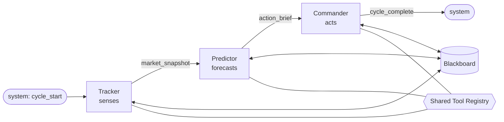

<h1 align="center">Swasthaveda Agents</h1>
<p align="center"><b>An autonomous three-agent marketing swarm for Swasthaveda Honey.</b><br>
Tracker senses. Predictor forecasts. Commander acts. Guardrails live in code.</p>

---

## Architecture



| Agent | Job | Tools it may call |
|---|---|---|
| **Tracker** | Channel metrics, ROAS anomalies, search trends, competitor prices | `scan_all_channels` `fetch_channel_metrics` `fetch_search_trends` `fetch_competitor_prices` |
| **Predictor** | Demand forecast, stock runway, budget-shift simulation (diminishing returns) | `forecast_demand` `forecast_roas_shift` `inventory_runway` |
| **Commander** | The only agent that acts | `reallocate_budget` `launch_promo` `schedule_content` `notify_human` |

All three also share `send_message`, `read_blackboard`, `write_blackboard`. One registry, per-agent allowlists.

**Design principles**

- **Guardrails in code, not prompts.** Budget-shift caps, discount caps and human-approval thresholds are enforced inside the tools.
- **Dry-run by default.** Nothing is applied until you pass `--live`.
- **Tools write their own results to the blackboard**, so downstream agents never depend on an LLM relaying numbers correctly.
- **Runs without an API key.** Each agent has a deterministic offline policy, so the whole loop is testable in CI.
- **Bounded autonomy.** Hop limit per cycle, tool-turn limit per agent, tool errors returned as data.

## Quickstart

```bash
pip install -e ".[dev]"
cp .env.example .env          # add ANTHROPIC_API_KEY for LLM mode; leave empty for offline mode
swasthaveda run --cycles 1 -v # dry-run
swasthaveda run --live        # apply actions
swasthaveda tools             # list registered tools
pytest -q
```

## Make it real

1. **Plug in your data.** Implement `DataSource` in `data_sources.py` (Meta/Google Ads, Shopify, GA4, Amazon, inventory) and call `set_source(...)`.
2. **Edit the domain.** Channels, budgets, ROAS targets, SKUs and seasonality live in `domain.py` (all placeholders).
3. **Add a tool.** Decorate a function, then add its name to an agent's `tools` tuple:

```python
@registry.tool
def pause_campaign(campaign_id: str, *, ctx: ToolContext) -> dict:
    """Pause a campaign."""
    ...
```

4. **Tune guardrails** in `config.py` (`Guardrails`).

## Layout

```
src/swasthaveda/
  agents/      base.py (LLM tool loop) tracker.py predictor.py commander.py
  tools/       registry.py comms.py tracking.py forecasting.py actions.py
  swarm.py     orchestrator          bus.py         message bus
  blackboard.py shared memory        data_sources.py adapters
  config.py    settings + guardrails domain.py     brand constants
tests/         offline end-to-end + guardrail tests
```

## Roadmap

- [ ] Real ad-platform adapters and OAuth
- [ ] Human-approval queue (Slack/WhatsApp) for `needs_approval` actions
- [ ] Post-action outcome tracking to close the learning loop
- [ ] Scheduler (cron / Cloud Run job)

## License

MIT
